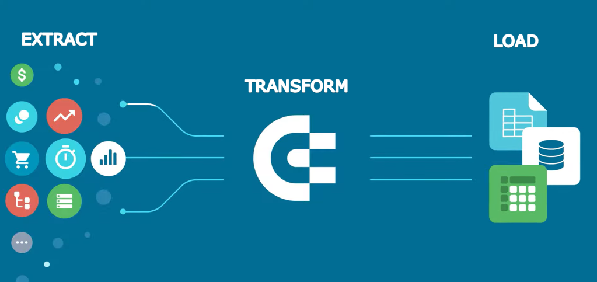

# Data Scientist | Data Engineer
      

#### **About Me :** I'm a Data Science Grad Student at Univeristy at Buffalo with 3.5+ years of industry experience in Cloud Infrastructure and Data Engineering domain. Currently, I'm interning at Calix as a Cloud Data Pipeline Intern, where I'm part of the Datalake team, working and learning about various aspects of cloud-based data processing pipelines. I'm passionate about the Data Science and Engineering field and their applications in generating valuable insights from messy and large datasets. Imagine a puzzle — I love piecing together information from chaotic datasets to reveal the big picture and unlock valuable insights!

#### **Technical Skills:** Kafka, Airflow, AWS S3, Apache Spark, Scala, Autosys, CyberArk, Sqoop, Hive, HDFS, Confluence, WebLogic, Big Data, Python, Linux, MySQL, Shell Scripting, IBM Connect Direct (NDM), ServiceNow, R Programming, Data Mining, SQL, Apache Iceberg, Presto, Deeque, Docker, ArgoCD, AWS, Intellij, Git, Bitbucket, JIRA, Maven

## Education					       		
- M.S, Engineering Science - Data Science	| University at Buffalo (Aug 2023 - Dec 2024)	        		
- B.Tech, Software Engineering | SRM Institute of Science and Technology, India (May 2015 - May 2019)

## Work Experience
**Cloud Data Pipeline Intern @ Calix (San Jose, CA, Remote)(_May 2024 - Present_)**
- Developed a highly scalable Spark-based SDK, leveraging distributed processing to significantly accelerate data encryption and decryption tasks by Transitioning from a REST API to a Spark-based SDK, reducing encryption time for 500 million records from 2-3 hours to just 25 minutes enabling faster and more secure processing of sensitive data, directly contributing to improved compliance and operational efficiency.
- Developed and integrated advanced data quality checks using Apache Deequ, including custom metrics like Bad Email Check, Completeness with Threshold, and IsEmpty validation, significantly reducing manual oversight, enhancing data accuracy and ensuring compliance with business rules.
-  Led a successful PoC to evaluate Apache Iceberg's compatibility with our data lake, focusing on optimizing data management for scalability and performance.
-  Integrated Apache Iceberg into the data lake to support incremental data loads alongside existing full loads, ensuring seamless handling of complex data operations like inserts, updates, and deletes.
- **Skills**: Spark, Scala, PySpark, Data Quality, Amazon Deeque, SDK, Apache Iceberg, DynamoDB, S3, PrestoDB
  
**Technology Analyst(Former Senior Systems Engineer) @ Infosys Pvt Ltd (_Jan 2020 - Jul 2023_)**
- Lead real-time data validation efforts using Apache Spark and advanced SQL techniques, ensuring strict adherence to SLAs for seamless data processing.
- Automated data import processes through Shell scripting, Airflow, and Sqoop, resulting in a significant reduction in manual efforts and enhanced operational efficiency.
- Architected seamless integration among Hive, Hbase, and Spark for agile data analysis and swift retrieval, optimizing complex operations.
- Developed and implemented strategies to optimize data querying efficiency, including Hive table management, partitioning, and incremental imports.
- Consistently exceeded client expectations, delivering exceptional results and maintaining a high standard of service delivery.
- Spearheaded configuration and troubleshooting of IBM Connect Direct/NDM connectivity, ensuring smooth data exchange across multiple partner systems.
- Managed end-to-end setup of Linux-based environments supporting Oracle Revenue Management and Billing (ORMB) applications across various instances (DEV/SIT/UAT/PTE/PROD/COB).
- Drove automation initiatives using shell scripts and Ansible playbooks, significantly reducing delivery time.
- Facilitated enhanced password management through the onboarding of database FIDs to CyberArk.
- Proficiently handled VM procurement, middleware application server setup, and system instance management.

## Projects
### [Advanced Predictive Modelling in Healthcare Data Analytics for Early Disease Detection and Proactive Medical Intervention](https://github.com/anehra-15/-Predictive-Modelling-for-Early-Disease-Detection-)

### [Loan Approval Predictor](https://github.com/anehra-15/Bank-Loan-Approval-Predictor)

### [Music Streaming Application Data ETL Pipeline using Python and AWS](https://github.com/anehra-15/Music_Data_ETL_Pipeline)

### [E-commerce Data Extraction with Python](https://github.com/anehra-15/E_commerce_Data_Extraction_with_Python)

